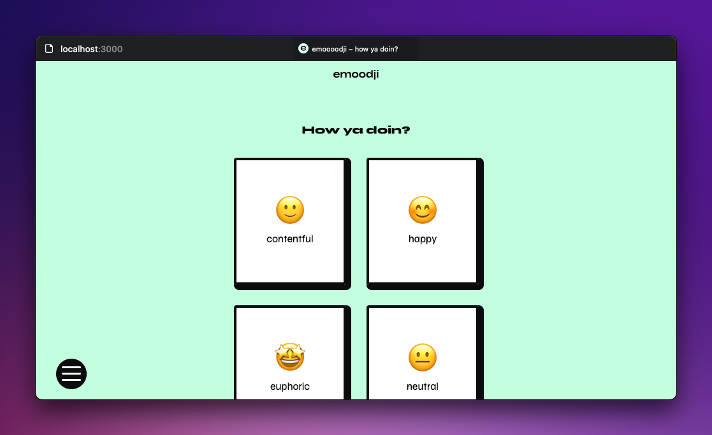

# emoodji 👋

## About the Project

  
Simple webapp to track your mood throughout the day.

### Built With

- [Nuxt3](https://v3.nuxtjs.org/)
- [VueUse](https://vueuse.org/)
- [Tailwind CSS](https://tailwindcss.com/)
- [Pinia](https://pinia.vuejs.org/)
- [TypeScript](https://typescript.nuxtjs.org/)
- [ESLint](https://eslint.org/)
- [Prettier](https://prettier.io/)
- [Pnpm](https://pnpm.io/)
- [Node.js v18](https://nodejs.org/en/)

## Getting Started

To get a local instance up and running follow these simple (or not, looking at you Node) steps.

### Requirements & Installation

- [Install Node.js v18 via n](https://github.com/tj/n) or [Install Node.js v18 via nvm](https://github.com/nvm-sh/nvm)
- [Install Pnpm](https://pnpm.io/installation)
- Clone the repo `git clone git@github.com:justpeterpan/emoodji.git`
- Install dependencies with `pnpm -i --shamefully-hoist` (Even tho Nuxt3 documentation recommends installing dependencies with the `--shamefully-hoist` option it is [highly discouraged](https://pnpm.io/cli/install#--shamefully-hoist) by Pnpm itself)
- Finally start the dev server on http://localhost:3000 `pnpm dev`

## Contributing

Based on [conventionl commits](https://www.conventionalcommits.org/en/v1.0.0/)

1. Clone Project
1. Create .env
1. Create Feature Branch (`git checkout -b feature/name-of-feature-or-post`)
1. Commit changes
   - New Feature: `git commit -m 'feat: new-feature-description'`
   - Bugfix: `git commit -m 'fix: bugfix-description'`
   - Refactoring: `git commit -m 'refactor: component-or-sth-else-description'`
   - Update: `git commit -m 'chore: dependency-name-version'`
   - Documentation: `git commit -m 'docs: update documentation-description`'
1. Push to branch (`git push origin feature/name-of-feature-or-post`)
1. Create new pull request

## Rough Roadmap

- [ ] Implement auth via supabase
- [ ] Add log-in view
- [ ] Add navbar/menu
- [ ] Add moodpicker view
- [ ] Add user based picked moods overview